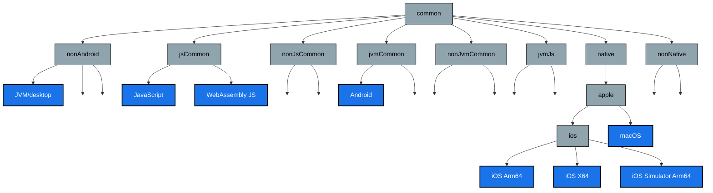
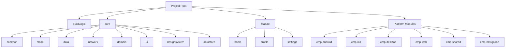

<div align="center">


<h1>KMP Multi-Module Project Generator</h1>

<p> 🚀 The Ultimate Kotlin Multiplatform Project Generator with Production-Ready Setup</p>


[](http://makeapullrequest.com)
[](https://github.com/openMF/kmp-project-template/blob/development/LICENSE)
[](https://github.com/openMF/kmp-project-template/releases/)
[](https://github.com/openMF/kmp-project-template/issues/)

[](https://github.com/openMF/kmp-project-template/actions/workflows/pr-check.yml)
[](https://join.slack.com/t/mifos/shared_invite/zt-2wvi9t82t-DuSBdqdQVOY9fsqsLjkKPA)
[](https://mifosforge.jira.com/jira/software/c/projects/KMPPT/boards/63)

</div>


> \[!Note]
>
> This branch is designed for partial customized projects. Running the `customizer.sh` script
> doesn't rename any application module, instead it'll change all `core` and `feature` module
> namespaces, packages, and other related configurations accordingly.
> and change your android and desktop application id and namespace in `libs.versions.toml` file.
>
> For full customization, please use the `full-customizable` branch instead.

## 🌟 Key Features

### 📱 Cross-Platform Support

- **Android**: Native Android app with Jetpack Compose
- **iOS**: Native iOS app with SwiftUI integration
- **Desktop**: JVM-based desktop application
- **Web**: Kotlin/JS with Compose Web
- **Shared Logic**: Common business logic across all platforms

### 🏗️ Architecture & Structure

- **Multi-Module Design**: Organized, scalable architecture
- **Clean Architecture**: Separation of concerns with domain, data, and presentation layers
- **Feature-First Modularization**: Independent feature modules for better maintainability
- **Shared UI Components**: Reusable Compose Multiplatform components
- **Platform-Specific Optimizations**: Native capabilities while maximizing code sharing
- **Advanced Source Set Hierarchy**: Sophisticated code sharing structure with logical platform
  groupings

  #### Source Set Hierarchy

  Our project implements a carefully designed hierarchical source set structure that optimizes code
  sharing across platforms:

    - **common**: Base shared code for all platforms
    - **nonAndroid**: Code shared between JVM, JS, and native platforms
    - **jsCommon**: Code for JavaScript-based platforms (JS, WebAssembly)
    - **nonJsCommon**: Code for non-JavaScript platforms (JVM, Android, Native)
    - **jvmCommon**: Code for JVM-based platforms (JVM, Android)
    - **nonJvmCommon**: Code for non-JVM platforms (JS, WebAssembly, Native)
    - **jvmJs**: Code shared between JVM and JavaScript platforms
    - **native**: Code for all native platforms with Apple-specific subgroups
    - **nonNative**: Code for non-native platforms (JS, WebAssembly, JVM, Android)
    - **Advanced Source Set Hierarchy**: Sophisticated code sharing structure with logical platform
      groupings

  > This hierarchical template is applied to both main and test source sets, establishing a
  consistent structure throughout the project.

  #### Hierarchical Structure

  Our project implements a carefully designed hierarchical source set structure that optimizes code
  sharing:

    - **common**: Base shared code for all platforms
    - **nonAndroid**: Code shared between JVM, JS, and native platforms
    - **jsCommon**: Code for JavaScript-based platforms (JS, WebAssembly)
    - **nonJsCommon**: Code for non-JavaScript platforms (JVM, Android, Native)
    - **jvmCommon**: Code for JVM-based platforms (JVM, Android)
    - **nonJvmCommon**: Code for non-JVM platforms (JS, WebAssembly, Native)
    - **jvmJs**: Code shared between JVM and JavaScript platforms
    - **native**: Code for all native platforms with Apple-specific subgroups
    - **nonNative**: Code for non-native platforms (JS, WebAssembly, JVM, Android)

  This hierarchical template is applied to both main and test source sets, establishing a consistent
  structure throughout the project.

### 🛠️ Development Tools

- **Gradle Kotlin DSL**: Modern build configuration
- **Version Catalogs**: Centralized dependency management
- **Type-Safe Accessors**: Improved build script maintainability
- **Custom Gradle Plugins**: Streamlined build process
- **Run Configurations**: Pre-configured for all platforms

### 🔍 Code Quality

- **Static Analysis**: Detekt for code quality checks
- **Code Formatting**: Spotless integration
- **Git Hooks**: Automated pre-commit checks
- **Style Guide Enforcement**: Consistent coding standards
- **Automated Testing**: Unit and integration test setup

### 📦 CI/CD Integration

- **GitHub Actions**: Automated build and test workflows
- **PR Checks**: Automated pull request validation
- **Fastlane Integration**: Automated deployment for Android and iOS
- **Dynamic Versioning**: Automated version management
- **Release Notes Generation**: Automated changelog creation

### 🎨 UI/UX Components

- **Design System**: Consistent styling across platforms
- **Theme Support**: Light/dark mode compatibility
- **UI Components**: Pre-built, customizable widgets
- **Resources Management**: Efficient asset handling
- **Accessibility**: Built-in accessibility support

### 💾 Data Management

- **DataStore Integration**: Efficient local storage
- **Network Layer**: API client setup
- **Caching Strategy**: Optimized data caching
- **Analytics Integration**: Ready-to-use analytics setup
- **Error Handling**: Comprehensive error management

### 🔄 Sync Capabilities

> For more information checkout [Readme](./docs/SYNC_SCRIPT.md) for more details.

- **Enhanced Directory Sync**: Comprehensive sync system for all project components
- **GitHub Actions Integration**: Automated weekly sync workflow with PR generation
- **Advanced Sync Script**: Feature-rich bash script with safety measures
- **Comprehensive Sync Coverage**: Syncs the following components:
    - **Applications**: cmp-android, cmp-desktop, cmp-ios, cmp-web
    - **Build System**: build-logic
    - **Tools**: fastlane, scripts
    - **Configuration**: config, .github, .run
    - **Core Files**: Gemfile, Gemfile.lock, ci-prepush scripts
- **Safety Features**: Automatic backups, error handling, and dry-run mode
- **Change Validation**: Smart detection of necessary updates

### 🔐 Secrets Manager

The repository includes a powerful keystore management script that automates the Android app signing
process across development and CI/CD environments.

#### Key Features

- **Dual Keystore Generation**: Creates both debug (ORIGINAL) and release (UPLOAD) keystores
- **Configuration Automation**: Automatically updates Gradle and Fastlane configurations
- **GitHub Secrets Management**: Seamlessly integrates with CI/CD pipelines
- **Secret Visualization**: View all managed secrets in a formatted table
- **Multi-environment Support**: Works with GitHub environment secrets

#### Usage

```bash
# Generate keystores and update configurations
./keystore-manager.sh generate

# View all secrets in a formatted table
./keystore-manager.sh view

# Add secrets to GitHub repository
./keystore-manager.sh add --repo=username/repo

# List all secrets in GitHub repository
./keystore-manager.sh list --repo=username/repo

# Delete a specific secret
./keystore-manager.sh delete --repo=username/repo --name=SECRET_NAME

# Delete all secrets defined in secrets.env
./keystore-manager.sh delete-all --repo=username/repo

# Delete all secrets including excluded ones
./keystore-manager.sh delete-all --repo=username/repo --include-excluded
```

#### Files Updated by Script

The script automatically updates several configuration files:

- **secrets.env**: Stores keystore credentials and base64-encoded keystores
- **fastlane-config/android_config.rb**: Updates Fastlane configuration
- **cmp-android/build.gradle.kts**: Updates Gradle signing configuration

#### Directory Structure

```
project/
├── keystore-manager.sh        # The main script
├── secrets.env                # Environment file with secrets
└── keystores/                 # Directory containing keystore files
    ├── original.keystore      # Debug/development keystore
    └── upload.keystore        # Release/production keystore
```

#### Security Best Practices

- Keystores are stored locally in the `keystores` directory
- Only base64-encoded versions are added as GitHub secrets
- Certificate information (company name, location) is excluded from GitHub
- Sensitive values can be quoted to handle spaces and special characters

For detailed information, run `./keystore-manager.sh help` or read
the [Secrets Manager](./docs/SECRETS_MANAGER.md)

## 🚀 Quick Start

### Prerequisites

- Bash 4.0+
- Unix-like environment (macOS, Linux) or Git Bash on Windows
- Android Studio/IntelliJ IDEA
- Xcode (for iOS development)
- Node.js (for web development)

### Installation

1. **Clone the Repository**

    ```bash
    git clone https://github.com/openMF/kmp-project-template.git
    cd kmp-project-template
    ```

2. **Run the Customizer**

    ```bash
    ./customizer.sh org.example.myapp MyKMPProject
    ```

3. **Build and Run**

    ```bash
    ./gradlew build
    ```

### Fastlane Configuration

- **Version Generation**: Supports git, Firebase, and Play Store-based versioning
- **Release Notes Generation**: Simple and full release notes generation
- **CI/CD Integration**: GitHub Actions and GitLab CI examples
- **Best Practices**: Securely manage sensitive data in CI/CD
- **Automated Deployment**: Firebase and Play Store deployment scripts
- **Testing**: Automated testing and deployment in staging environment
- **Dependency Management**: Keep Fastlane and plugins updated
- **Staging Environment**: Test deployment scripts in a staging environment
- **Configuration**: Update platform specific configurations in `fastlane-config` directory

### Using the Sync System

#### Manual Sync with Advanced Options

```bash
# Basic sync
./sync-dirs.sh

# Dry run to preview changes
./sync-dirs.sh --dry-run

# Force sync without prompts
./sync-dirs.sh --force

# Both dry run and force mode
./sync-dirs.sh --dry-run --force
```

#### Script Features

- **Backup System**: Automatic backup of existing files before modification
- **Error Handling**: Comprehensive error detection and recovery
- **Progress Indication**: Visual feedback during sync operations
- **Logging**: Detailed logs of all operations
- **Dry Run Mode**: Preview changes without applying them
- **Force Mode**: Non-interactive operation for automation

#### Automated GitHub Workflow

The repository includes an enhanced GitHub workflow (`sync-dirs.yml`) that:

- Runs automatically every Monday at midnight UTC
- Supports manual triggering from GitHub Actions UI
- Creates detailed pull requests for review
- Includes comprehensive change logs
- Handles all sync components safely
- Maintains proper git history

#### Required Workflow Permissions Setup

1. Go to your repository's **Settings**
2. Navigate to **Actions** > **General** in the left sidebar
3. Scroll down to **Workflow permissions**
4. Enable the following permissions:

    - ✅ Select "**Read and write permissions**"
    - ✅ Check "**Allow GitHub Actions to create and approve pull requests**"

5. Click "**Save**" to apply the changes


---

#### How to Create a PAT Token and Save It as a Repository or Organization Secret

To use the `sync-dirs.yml` workflow effectively, follow these steps to create a Personal Access
Token (PAT) with the required scopes and save it as a secret:

---

#### 1. **Create a Personal Access Token (PAT)**

1. Log in to your GitHub account.
2. Go to your [Developer Settings > Personal Access Tokens](https://github.com/settings/tokens).
3. Click **Generate new token (classic)** or select **Fine-grained tokens** if classic tokens are
   deprecated.
4. Fill in the following details:
    - **Note**: Add a meaningful name like `Sync Workflow Token`.
    - **Expiration**: Choose an expiration period (e.g., 30 or 90 days). For long-term usage,
      select "No
      Expiration," but ensure the token is rotated periodically.
    - **Scopes**:
        - ✅ `repo` – Full control of private repositories (for accessing the repository).
        - ✅ `workflow` – To manage and trigger workflows.
        - ✅ `write:packages` – To publish and write packages (if applicable).

5. Click **Generate token**.
6. Copy the token immediately and save it securely. You won't be able to view it again.

---

#### 2. **Save the PAT Token as a Secret**

##### **For a Repository**:

1. Navigate to the repository where the workflow resides.
2. Go to **Settings** > **Secrets and variables** > **Actions**.
3. Click **New repository secret**.
4. Enter the following details:
    - **Name**: `PAT_TOKEN`
    - **Value**: Paste the PAT token you copied earlier.
5. Click **Add secret**.

##### **For an Organization**:

1. Navigate to the organization settings.
2. Go to **Settings** > **Secrets and variables** > **Actions**.
3. Click **New organization secret**.
4. Enter the following details:
    - **Name**: `PAT_TOKEN`
    - **Value**: Paste the PAT token you copied earlier.

5. Choose the repositories where this secret will be available.
6. Click **Add secret**.

---

## 📁 Project Structure

### Module Structure

### Source Set Hierarchy

The project implements a sophisticated hierarchical structure for organizing Kotlin Multiplatform
source sets:



This structure enables efficient code sharing between platforms with similar characteristics. Each
source set group serves a specific purpose:

- **Blue Nodes**: Intermediate source set groups (shared code)
- **Blue with White Text**: Actual platform implementations

### Project Directory Structure

#### Core Modules

```
core/
├── analytics/    # Analytics and tracking
├── common/       # Shared utilities and extensions
├── data/         # Data layer implementation
├── datastore/    # Local storage management
├── domain/       # Business logic and use cases
├── model/        # Data models and entities
├── network/      # Network communication
├── ui/           # Shared UI components
└── designsystem/ # Design system components
```

### Core Base Modules

The core-base package contains reusable foundational components shared across all apps built with
this template:

```
core-base/
├── database/    # Shared DB layer
├── datastore/       # Preference storage using russhwolf/multiplatform-settings
├── network/         # API communication module powered by Ktorfit
```

- View core-base/network README

### Feature Modules

```
feature/
├── home/        # Home screen features
├── profile/     # User profile management
└── settings/    # App settings
```

### Platform-Specific

```
cmp-android/     # Android app
cmp-ios/         # iOS app
cmp-desktop/     # Desktop app
cmp-web/         # Web app
cmp-shared/      # Shared code
cmp-navigation/  # Navigation components
```

### Source Set Organization

Each module follows the hierarchical source set structure:

```
src/
├── commonMain/kotlin/          # Common code for all platforms
├── nonAndroidMain/kotlin/      # Code for non-Android platforms
├── jsCommonMain/kotlin/        # Code for JS-based platforms
├── nonJsCommonMain/kotlin/     # Code for non-JS platforms
├── jvmCommonMain/kotlin/       # Code for JVM-based platforms
├── nonJvmCommonMain/kotlin/    # Code for non-JVM platforms
├── jvmJsMain/kotlin/           # Code shared between JVM and JS platforms
├── nativeMain/kotlin/          # Code for native platforms
│   ├── apple/                  # Code for Apple platforms
│   │   ├── ios/                # iOS-specific code
│   │   └── macos/              # macOS-specific code
├── nonNativeMain/kotlin/       # Code for non-native platforms
├── desktopMain/kotlin/         # JVM-specific code
├── androidMain/kotlin/         # Android-specific code
├── iosMain/kotlin/             # General iOS code
├── iosArm64Main/kotlin/        # iOS device-specific code
├── iosX64Main/kotlin/          # iOS simulator (Intel) code
├── iosSimulatorArm64Main/kotlin/ # iOS simulator (Arm64) code
├── jsMain/kotlin/              # JavaScript-specific code
└── wasmJsMain/kotlin/          # WebAssembly JS-specific code
```

## 🔄 Module Dependencies



## 🔄 Staying in Sync with Upstream

### Manual Sync

1. Use the provided `sync-dirs.sh` script to sync specific CMP directories
2. Review changes before committing
3. Push changes to your repository

### Automated Sync

1. The GitHub workflow automatically syncs directories weekly
2. Review and merge the generated pull requests
3. Manual sync can be triggered from GitHub Actions

### Best Practices for Sync Management

1. **Regular Syncs**: Keep up with upstream changes through weekly automated syncs
2. **Review Changes**: Always review generated PRs carefully
3. **Backup First**: Use --dry-run before actual sync operations
4. **Conflict Resolution**: Handle merge conflicts promptly
5. **Version Control**: Maintain clean git history during syncs

## 🤝 Contributing

We welcome contributions! Here's how you can help:

1. Fork the repository
2. Create a feature branch: `git checkout -b feature/amazing-feature`
3. Commit changes: `git commit -m 'Add amazing feature'`
4. Push to the branch: `git push origin feature/amazing-feature`
5. Open a pull request

## 📚 Documentation

> Documentation is a work in progress.

- [Setup Guide](docs/SETUP.md)
- [Architecture Overview](docs/ARCHITECTURE.md)
- [Contributing Guidelines](CONTRIBUTING.md)
- [Code Style Guide](docs/STYLE_GUIDE.md)
- [Networking Module](core-base/network/README.md)
- [Source Set Hierarchy](docs/SOURCE_SET_HIERARCHY.md)
- [Source Set Hierarchy](docs/SOURCE_SET_HIERARCHY.md)

## 📫 Support

- Join
  our [Slack channel](https://join.slack.com/t/mifos/shared_invite/zt-2wvi9t82t-DuSBdqdQVOY9fsqsLjkKPA)
- Report issues on [GitHub](https://github.com/openMF/kmp-project-template/issues)
- Track progress
  on [Jira](https://mifosforge.jira.com/jira/software/c/projects/KMPPT/boards/63)

## 📄 License

This project is licensed under the [Mozilla Public License 2.0](LICENSE).